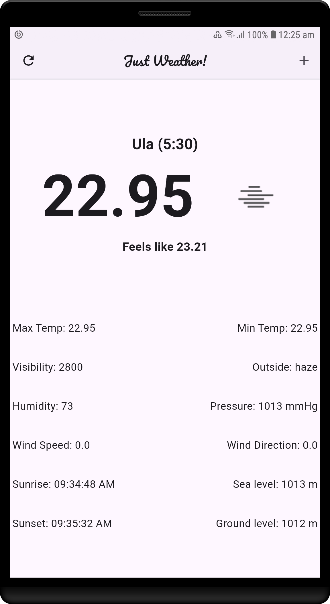

# JustWeather

 <!-- Replace with your app's logo if available -->

A minimal yet powerful weather app built with Flutter. JustWeather provides real-time weather updates, current location support, and easy location management.

## Features

- 🌦 **Real-Time Weather** - Get the latest weather updates for any location.
- 📍 **Current Location Support** - Automatically fetch weather for your location.
- 📌 **Multiple Locations** - Add and manage multiple locations.
- 🔄 **Pull to Refresh** - Quickly refresh weather data.
- 🎨 **Smooth UI** - Simple and elegant user interface.
- ⚡ **Fast & Lightweight** - Optimized for performance.

## Screenshots

<!-- Add screenshots of your app -->

| Home Page  | Locations Page |
|------------|---------------|
|  |  |

## Installation

1. **Clone the Repository**
   ```bash
   git clone https://github.com/Arghya-1121/JustWeather.git
   cd JustWeather
   ```

2. **Install Dependencies**
   ```bash
   flutter pub get
   ```

3. **Run the App**
   ```bash
   flutter run
   ```

## Setup

- **API Key**: Update `fetch_data.dart` with your OpenWeather API key.
- **Permissions**: Ensure location permissions are granted for current location features.

## Technologies Used

- **Flutter** - Frontend framework
- **Dart** - Programming language
- **OpenWeather API** - Weather data provider

## Contribution

Feel free to contribute by creating issues or pull requests. If you find a bug or want to suggest a feature, open an issue!

## License

This project is licensed under the MIT License - see the [LICENSE](LICENSE) file for details.

---

Made with ❤️ by [Arghya Sarkar](https://github.com/Arghya-1121)

